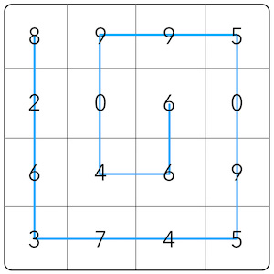

# Arr-Sort Challenge (Javascript || Ruby)

In this challenge, you need to implement a function that will receive an array of integers, which must be sorted by the outermost elements to the middle element, traveling counterclockwise.

As an example, given this array:

`[8, 9, 9, 5, 2, 0, 6, 0, 6, 4, 6, 9, 3, 7, 4, 5]`

You must sort it as depicted here:

Meaning the solution would be:

`[8, 2, 6, 3, 7, 4, 5, 9, 0, 5, 9, 9, 0, 4, 6, 6]`

## Notes

- Your implementation must work for three given arrays of the following lengths: 9, 16, 25

## Testing (Javascript)

- Build your solution in `index.js`
- Run `npm install` or `yarn install`
- Run `npm test` or `yarn test`
- No Errors? Go ahead and submit a Pull Request!

## Testing (Ruby)

- Run `ruby -Ilib:test array-sort/test.rb `
- No Errors? Go ahead and submit a Pull Request!
